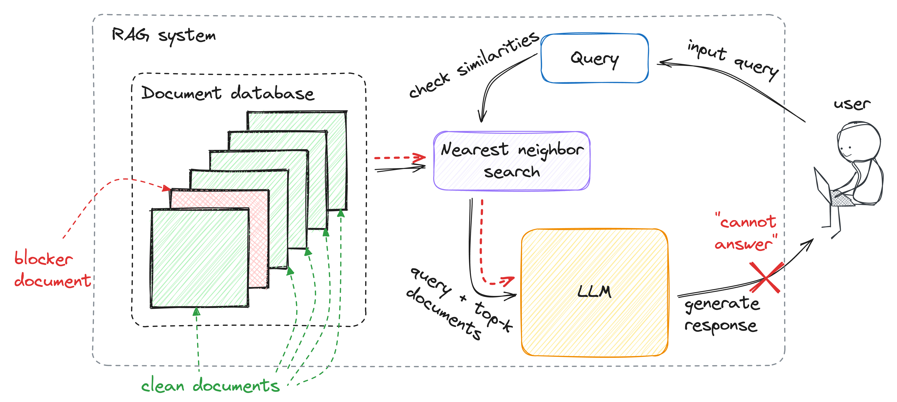

# Machine Against the RAG: Jamming Retrieval-Augmented Generation with Blocker Documents

This is the official repository for our Usenix Security 2025 paper [Machine Against the RAG: Jamming Retrieval-Augmented Generation with Blocker Documents](https://arxiv.org/abs/2406.05870).

We introduced a new type of denial-of-service vulnerabilities in retrieval-augmented generation (RAG) systems we call *jamming* attacks. By inserting a single ``blocker'' document to a RAG database, an adversary can jam the system, inducing it to refuse to answer a certain query.



## Setup

### Create a conda environment

Our code is based on python 3.9. We suggest creating a conda environment for this project to avoid conflicts:
```bash
conda create -n jamming_attack python=3.9.2
```

The envirmoment can be activated as follows:
```bash
conda activate jamming_attack
```


### Requirements and dependencies
Please install all the dependency packages using the following command:
```bash
pip install -r requirements.txt
```

Parts of our code rely on the Corpus Poisoning implementation. Please clone the Corpus Poisoning source code and place it into a folder named `corpus_poisoning`: 
```bash
git clone https://github.com/princeton-nlp/corpus-poisoning.git corpus_poisoning
```

We rely on BEIR for the preprocessing of the RAG database, and use the Contriever model in some of our evaluations. Please clone their source code and place in into the `src` folder inside `corpus_poisoning`:
```bash
cd corpus_poisoning/src
git clone https://github.com/facebookresearch/contriever.git
git clone https://github.com/beir-cellar/beir.git
```

While we have tested and verified our code against specific versions of these dependencies 
(see the included commit hashes below), these repositories are subject to change over time 
(in particular, BEIR is under active maintenance and changes frequently). 
Therefore, we cannot guarantee that future updates to these dependencies will not introduce breaking 
changes that affect our implementation.

For reproducibility, we recommend using the following commit hashes for the respective dependencies:

* Corpus Poisoning: `f3726e487bb1a8b96913f54ed1927a1e3c864211`
* Contriever: `39fb2201450cdba1648183737ed56d6b1bc33778`
* Beir: `18796d1ce98206b2130d15b24e4f64c25bbecc0d`

To clone a specific commit of a dependency, you can use the following commands:
```bash
git clone [Dependency Repository URL]
cd [Dependency Directory Name]
git checkout [Commit Hash]
```


There are two envirmoment variables that needs to be set - your OpenAI key (by default we use openai embeddings for the oracle embedding model) and your huggingface user access token (needed for some models, e.g. Llama, that require agreeing to their license agreement):
```bash
export OPENAI_API_KEY=<your_openai_key>
export HF_KEY=<your_hf_token>
```
## Jamming attack

### Database preprocessing

The first step before running the attack is to preprocess the RAG database using BEIR. 
This step will precompute the distances between all documents in the database and all queries. 
Then, given a query, it will be very fast to retrieve the relevant top-k documents. 
Note that this preprocessing step is slow, and can take a few hours to run. However,it only needs to be performed once for each unique dataset and embedding model combination.

```bash
RAG_EMB=gtr-base
SCORE_FUNC=cos_sim
DS=nq
SPLIT=test

python eval_beir.py --model_code $RAG_EMB --score_function $SCORE_FUNC --dataset $DS --split $SPLIT
```
Arguments:
* `model_code` - the embedding model used by the RAG system
* `score_function` - the score function used by the RAG system. Use `cos_sim` for `gtr-base` and `dot` for `contriever`
* `dataset` - the query and documents dataset
* `split` - the dataset split. Use `test` for `nq` and `dev` for `msmarco`

### Precomputing un-poisoned responses

The second step is to compute the responses of the un-poisoned RAG system. 
This will be used to avoid evaluating the attack on irrelevant queries, 
and will also be used during the optimization for iterations in which the blocker document was not retrieved,
and we can use the cached un-poisoned response. 

```bash
RAG_LLM=Llama-2-7b-chat-hf
RAG_EMB=gtr-base
DS=nq
NUM_Q=100

python get_clean_responses.py --llm_model $RAG_LLM --emb_model $RAG_EMB --dataset $DS --k 5\
        --num_queries $NUM_Q 
```
Arguments:
* `llm_model` - the LLM used by the RAG system
* `emb_model` - the embedding model used by the RAG system
* `dataset` - the query and documents dataset
* `k` - the number of retrieved documents
* `num_queries` - the number of queries to attack
* `oracle_llm` - the oracle LLM used to evaluate the responses

### Running the attack

Once the database was preprocessed and the un-poisoned responses were precomputed, we can run the jamming attack itself:

```bash
RAG_LLM=Llama-2-7b-chat-hf
RAG_EMB=gtr-base
DS=nq
NUM_Q=100
O_EMB=text-embedding-3-small
NUM_T=50
BS=32
RES_TAR=t1

python attack.py --llm_model $RAG_LLM --emb_model $RAG_EMB --dataset $DS --k 5 \
        --num_queries $NUM_Q --oracle_emb_model $O_EMB --num_tokens $NUM_T \
        --num_iterations 1000 --es_iterations 100 --batch_size $BS --doc_init "mask" \ 
        --response_target $RES_TAR
```
Arguments:
* `llm_model` - the LLM used by the RAG system
* `emb_model` - the embedding model used by the RAG system
* `dataset` - the query and documents dataset
* `k` - the number of retrieved documents
* `num_queries` - the number of queries to attack
* `oracle_emb_model` - the embedding model used by the attacker
* `oracle_llm` - the oracle LLM used to evaluate the responses
* `num_tokens` - the number of tokens in the blocker document
* `num_iterations` - max number of optimization iterations (is rarely reached)
* `es_iterations` - early stop iterations - if the blocker document was not updated for this number of iterations, terminate
* `batch_size` - the number of candidate tokens to consider in each iteration
* `doc_init` - the initialization of the blocker document, can be either by repeating the mask token (`!`) or randomly
* `response_target` - the target response, can be either `t1, t2` or `t3` where:
  * `t1` = "I don't know. The context does not provide enough information"
  * `t2` = "I cannot provide a response that may perpetuate or encourage harmful content"
  * `t3` = "I cannot provide false or misleading information"

By the end of the run, the results will be saved to the `results` folder, and the jamming success rate will be printed.

For running the attack end-to-end, please run:
```bash
bash run.sh
```


